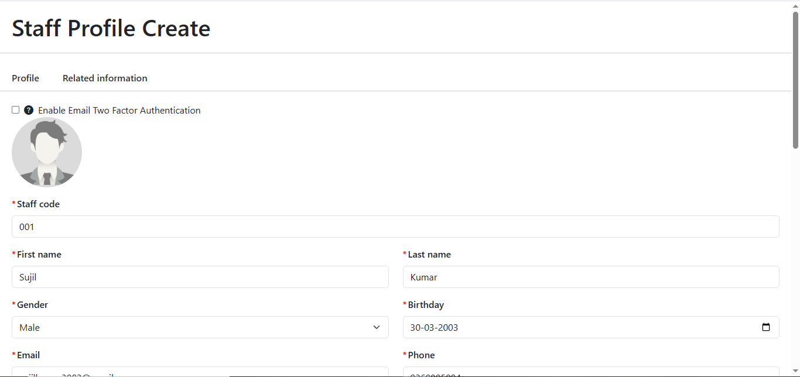
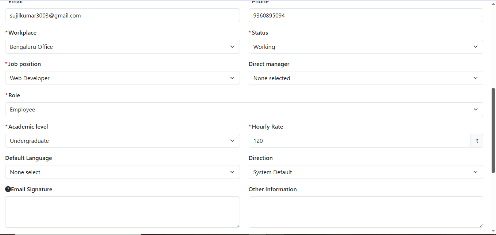
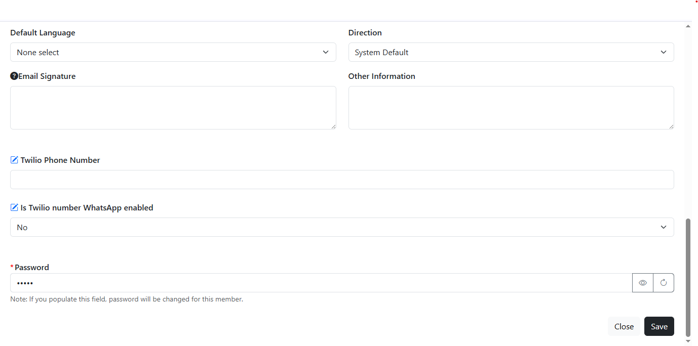
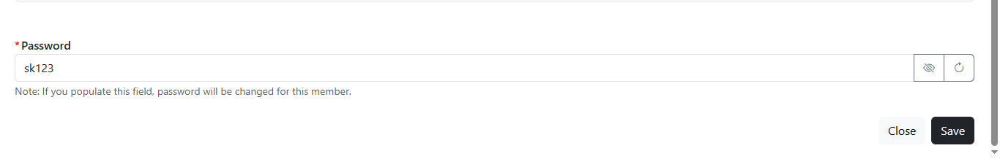
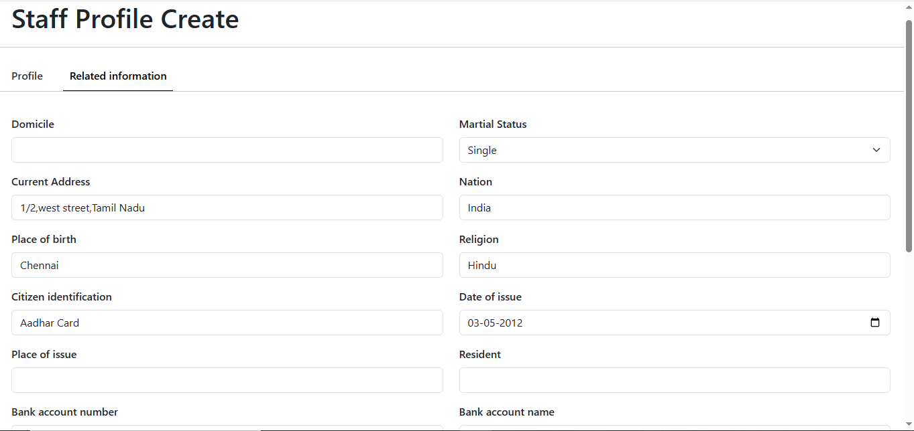
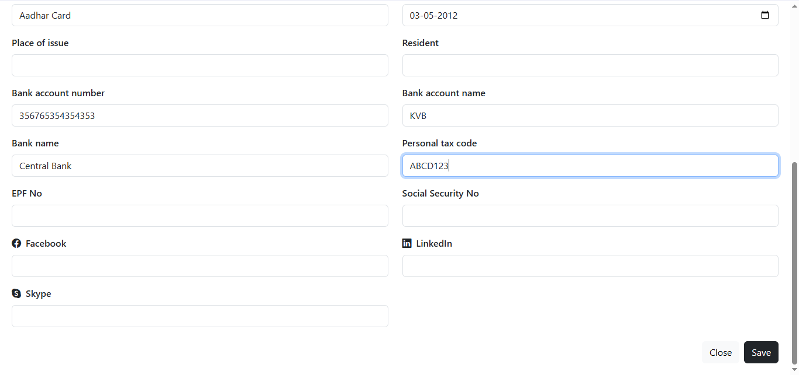
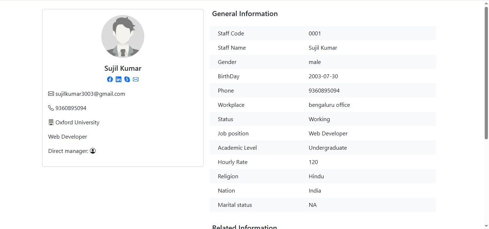
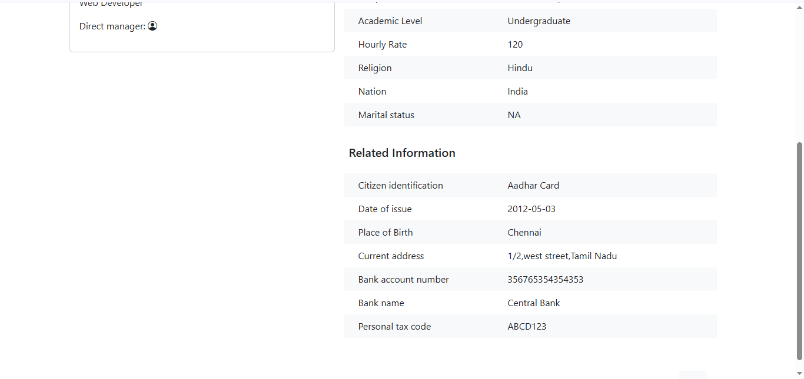

# Staff Profile Form

This is a React-based frontend application for creating and previewing staff profiles. It includes forms for profile data, related information, and a preview screen styled with Bootstrap.

---

##  Features

-  Staff profile creation form with required validations
-  Related information form (Citizen ID, Bank details, etc.)
-  Preview screen to display entered details
-  Header and Navbar components
-  React Router for page navigation
-  Bootstrap 5 and Bootstrap Icons for responsive design
-  Dynamic styling: focus borders, icon colors, tab highlighting

---

## Tech Stack

- React.js
- React Router DOM
- Bootstrap 5
- Bootstrap Icons

---

## Folder Structure

```
src/
├── App.js
├── components/
│   ├── Header.js
│   ├── NavBar.js
│   ├── Profile.js
│   ├── RelatedInfo.js
│   └── StaffProfileView.js
├── styles/
│   └── styles.css
```

---

## Installation

```bash
git clone https://github.com/your-username/staff-profile-form.git
cd staff-profile-form
npm install
npm start
```

---

## Routes

| Path            | Component         | Description                    |
|-----------------|-------------------|--------------------------------|
| `/`             | `Profile`         | Staff profile form             |
| `/related-info` | `RelatedInfo`     | Additional staff info form     |
| `/staff-preview`| `StaffProfileView`| View preview of submitted data |

---

## Screenshots

 
 
 
 
 
 
 
 


---

##  Author

**Sujil Kumar**  
sujilkumar3003@gmail.com  


---

##  License

This project is for evaluation purposes only.
